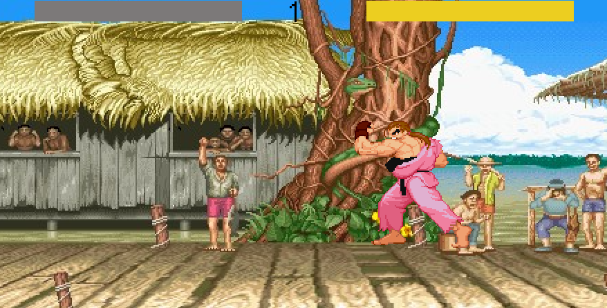

# On Fighting

A Fighting game made for the [Game Off 2022](https://itch.io/jam/game-off-2022)

## Theme : Cliché

### How is the theme implemented:

#### 1. Projectile Attack

In every fighting game there have to be a projectile we can throw away to the ennemy: in this game, it's the only way to harm ennemies

#### 2. Block ennemy attack

You have to be able to block ennemies's attack, in this game you can't.  
 You may possibly throw a projectile away so it'll collide with the other one the ennemy has send, That's the only workaround you have.

### Language : Haxe

### Engine : Heaps

### Play on itch.io: [https://senor16.itch.io/on-fighting](https://senor16.itch.io/on-fighting)

### Controls :

Arrow keys, WASD, to move  
Throw a projectile : S D S D + I

### Code : By me

### Graphics :

- Character tiles : FIREJOKER54
  - Ken masters -- Street Fighter Alpha 3 (Arcade)
  - Dan Hibiki -- Street Fighter Alpha 3 (Arcade)

### Development duration : 20h 11mins

### Screenshots:

  

